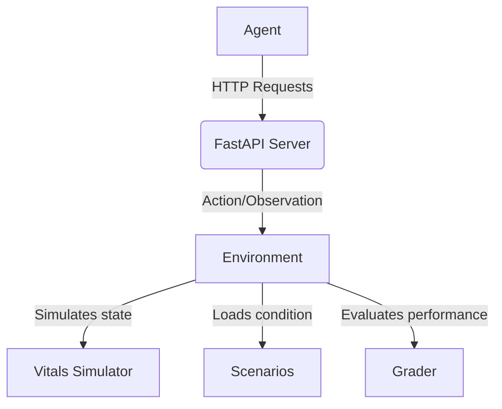

# System Architecture

The SignCheck-env follows a clear flow to simulate and evaluate an agent's ability to manage patient vitals.

## System Flow

1. **Agent**: The external AI system being evaluated. It observes the environment state and outputs actions.
2. **FastAPI server**: Serves as the interface (`server/main.py`), exposing the underlying environment via standardized HTTP endpoints.
3. **Environment**: The core orchestration layer (`server/env.py`) that manages the interaction between the agent interface and the background simulation.
4. **Vitals simulator**: Models patient physiology (`server/vitals.py`), handling the continuous evolution of vital signs over time.
5. **Scenarios**: Defines the specific clinical conditions (`server/scenarios.py`) being simulated, including initial states and degradation pathways.
6. **Grader**: Deterministically evaluates (`server/grader.py`) the agent's actions based on the specific scenario requirements, timeliness, and correctness.
