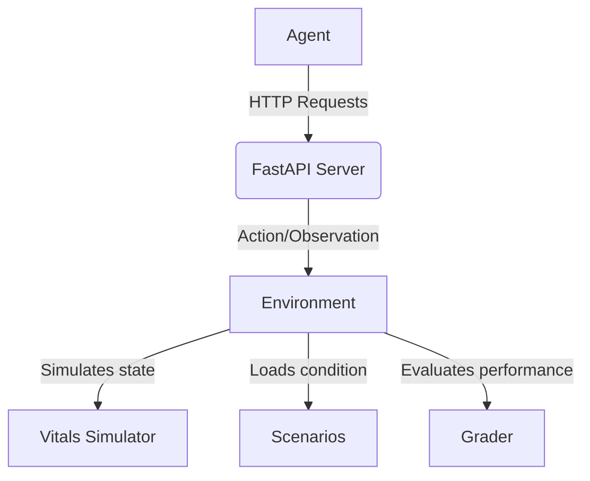

# System Architecture

The SignCheck-env follows a clear flow to simulate and evaluate an agent's ability to manage patient vitals.

## System Flow

1. **Agent (`inference.py`)**: The external AI system being evaluated. It observes the environment state and outputs actions.
2. **FastAPI Server (`server/main.py`)**: Serves as the interface, exposing the underlying environment via standardized HTTP endpoints.
3. **Environment Engine (`server/env.py`)**: The core orchestration layer that manages the interaction between the agent interface and the background simulation.
4. **Vitals Simulator (`server/vitals.py`)**: Models patient physiology, handling the continuous evolution of vital signs over time.
5. **Scenario Logic (`server/scenarios.py`)**: Defines the specific clinical conditions being simulated, including initial states and degradation pathways.
6. **Grader (`server/grader.py`)**: Deterministically evaluates the agent's actions based on the specific scenario requirements, timeliness, and correctness.
